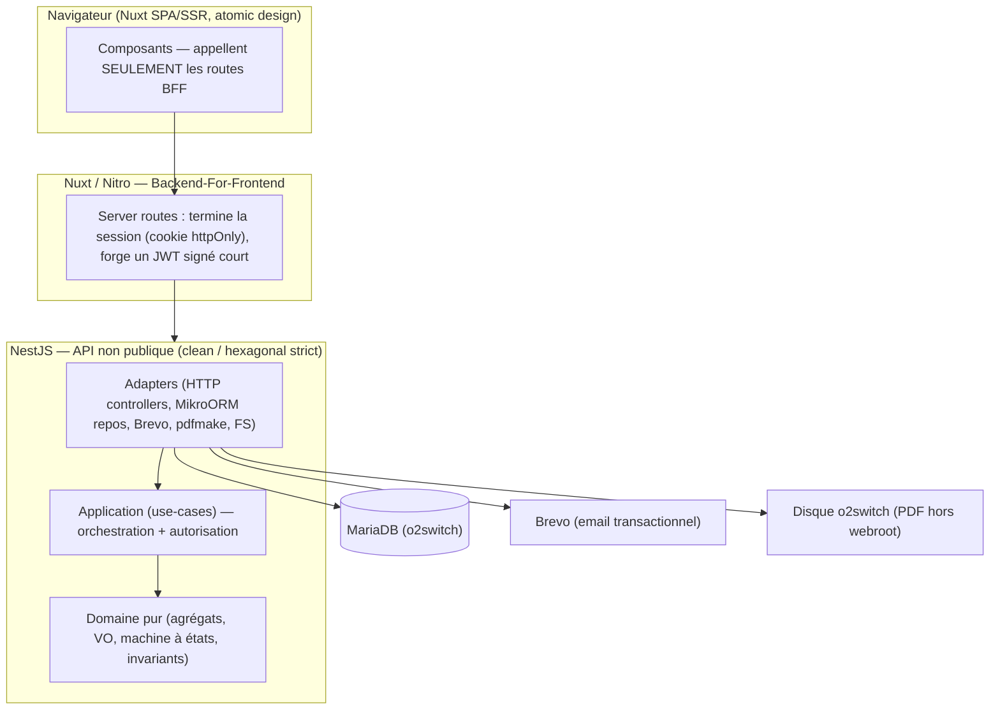
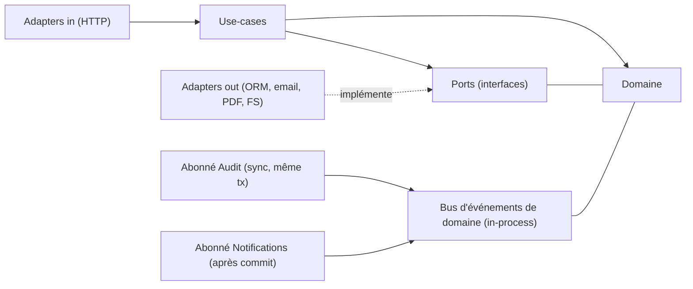
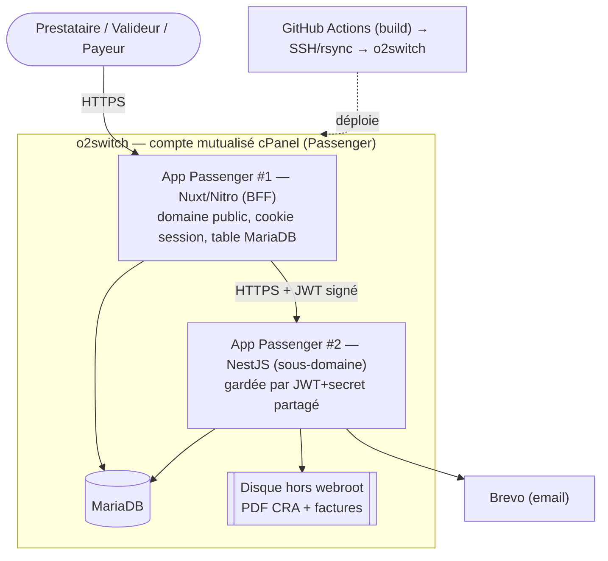
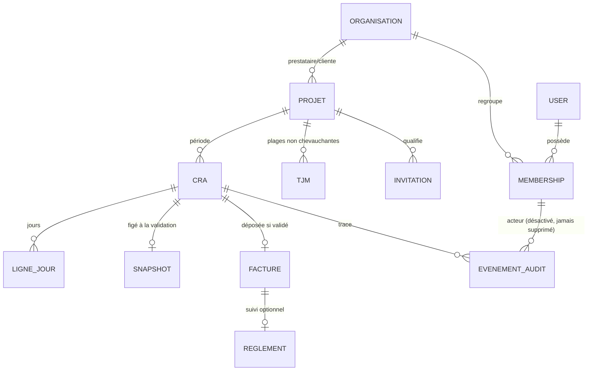
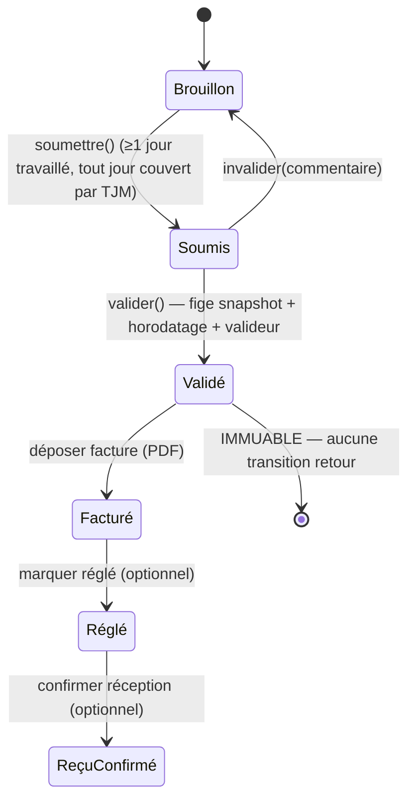

# Architecture Spine — Gestionnaire de CRA

> Contrat d'invariants v1. Fixe les calls non-évidents qui empêchent les unités construites séparément (front Nuxt, modules NestJS, schéma MariaDB) de diverger. La stack est posée ; le code possède le détail dès qu'il existe.

## Design Paradigm

**Architecture hexagonale stricte (ports & adapters), un module NestJS par contexte borné, derrière un Backend-For-Frontend Nuxt (Nitro).**

Le navigateur ne parle qu'au serveur Nuxt/Nitro (BFF), qui termine l'authentification et relaie vers une API NestJS non publique. Chaque contexte borné du back est une tranche hexagonale : un **domaine pur** au centre (entités, value objects, machine à états — sans dépendance framework ni ORM), entouré de **ports** (interfaces) que des **adapters** périphériques (MikroORM, HTTP, Brevo, pdfmake, disque) implémentent. **Toutes les dépendances pointent vers le domaine.**



Mantra produit porté dans l'archi : **« simple, avec une vue rapide »** — le statut et le chiffre clé d'abord. Le statut métier est calculé par le domaine ; tout le reste n'en est que le reflet.

## Invariants & Rules

Direction des dépendances (qui peut dépendre de qui) — c'est une règle, pas une illustration :



### AD-1 — Topologie BFF [ADOPTED]
- **Binds:** `all` (front ↔ back), NFR sécurité
- **Prevents:** que le navigateur appelle NestJS en direct, que la gestion de token fuie côté client, deux contrats à synchroniser
- **Rule:** Le navigateur ne contacte **que** les server routes Nuxt/Nitro. NestJS n'est jamais appelé depuis le navigateur. Le BFF est un **proxy mince** : il termine l'auth et relaie, il **ne reshape pas** les données métier. Un seul contrat fait foi, défini côté NestJS.

### AD-2 — Hexagonal strict, dépendances vers le domaine [ADOPTED]
- **Binds:** tous les modules NestJS
- **Prevents:** que la règle métier fuie dans les services ou l'ORM ; des invariants juridiques contournables
- **Rule:** Chaque contexte = domaine pur (entités + VO, sans décorateur framework/ORM) + ports + use-cases + adapters. Les dépendances pointent **uniquement vers le domaine**. Aucun import de framework/ORM dans la couche domaine.

### AD-3 — Contextes bornés étanches [ADOPTED]
- **Binds:** IAM, Projects, CRA, Invoicing, Settlement, Notifications, Audit, Documents
- **Prevents:** deux modules propriétaires d'une même donnée ; un module lisant la table d'un autre
- **Rule:** Un contexte n'accède **jamais** au repo ni à la persistance d'un autre. Toute donnée d'un autre contexte se consomme via un **port** exposé par ce contexte, ou via un **événement de domaine**.

### AD-4 — Communication par événements de domaine [ADOPTED]
- **Binds:** tout flux inter-contextes, notamment Notifications & Audit
- **Prevents:** couplage du cœur à ses consommateurs ; chaque nouveau listener modifiant les use-cases du cœur
- **Rule:** Les contextes communiquent par **événements de domaine sur un bus in-process** (`CraSoumis`, `CraValidé`, `CraInvalidé`, `FactureDéposée`, `RèglementConfirmé`…). Le cœur émet sans connaître ses abonnés.

### AD-5 — Garantie de livraison différenciée [ADOPTED]
- **Binds:** Audit, Notifications
- **Prevents:** une trace d'audit perdue (valeur probante) ; un échec d'email annulant une transition métier
- **Rule:** Les événements sont dispatchés dans l'**Unit of Work** du use-case. L'abonné **Audit s'exécute en synchrone, dans la même transaction** (committé atomiquement avec le changement d'état). Les **Notifications passent par l'outbox transactionnel** (AD-22) — écrites dans la même transaction, livrées après commit par un relais idempotent ; un échec d'envoi ne perd jamais la notification ni n'annule la transition.

### AD-6 — Propriété et résolution du TJM [ADOPTED]
- **Binds:** Projects (FR7), CRA (FR14)
- **Prevents:** deux sources de vérité du TJM ; un CRA lisant directement les plages TJM ; des plages chevauchantes
- **Rule:** **Projects** est seul propriétaire des plages de TJM et garantit qu'elles **ne se chevauchent pas** (un seul TJM par date). **CRA** résout le montant via un **port `TjmResolver.resolveForDate(date)`** exposé par Projects — jamais en lecture directe.

### AD-7 — Machine à états possédée par l'agrégat CRA [ADOPTED]
- **Binds:** CRA (FR12–FR19, FR33)
- **Prevents:** un statut fixé hors du domaine ; une transition illégale ; des invariants de cycle de vie contournés ; deux CRA pour une même période
- **Rule:** Les transitions sont des **méthodes de l'agrégat CRA** (`soumettre`, `valider`, `invalider`) qui vérifient l'état de départ et lèvent sinon. **Aucun use-case ni repo ne fixe le statut directement.** `soumettre()` lève si un jour travaillé n'a aucun TJM applicable ou si zéro jour travaillé (FR15). Multi-valideurs : **première validation gagne et verrouille**, via verrou **optimiste** sur la version de l'agrégat (FR17). Les **éditions de contenu** en `Brouillon`/`Invalidé` (saisie au fil de l'eau, FR13) sont **auto-sauvées en continu sans transition d'état** — elles ne passent pas par la machine ; seules `soumettre/valider/invalider` sont des transitions. **Unicité : un seul CRA par `(projet, période)`** (contrainte d'unicité côté persistance).

### AD-8 — Immuabilité du CRA validé + snapshot figé [ADOPTED]
- **Binds:** CRA (FR19, FR33), valeur probante de la signature (FR20)
- **Prevents:** la modification d'un engagement signé ; qu'un changement de TJM altère un CRA validé ; trois montants divergents (CRA / PDF / facture)
- **Rule:** À la validation, l'agrégat **fige un snapshot de forme fixe** : `{ montant_total_centimes, devise:"EUR", tjm_appliqués: [{ date_debut, date_fin, montant_centimes }], jours: [{ date, état, fraction }] }` + horodatage + valideur. **Le PDF du CRA et la facture DÉRIVENT du snapshot, jamais d'un recalcul** → un seul montant fait foi. **Aucune méthode de déverrouillage/réouverture n'existe** sur un CRA validé — l'absence de la méthode *est* la garantie (pas même pour l'admin). Le recalcul continu (FR14) ne s'applique qu'aux CRA non validés. Seule correction aval : remplacer la facture (AD-15).

### AD-9 — Légalité (domaine) vs autorisation (application) [ADOPTED]
- **Binds:** tous les use-cases mutateurs
- **Prevents:** confondre « la transition est-elle permise par l'état » et « cet acteur a-t-il le droit »
- **Rule:** Le **domaine** garantit la **légalité** de la transition (bon état de départ). L'**application** (use-case) garantit l'**autorisation** (bon rôle + bonne organisation) via un **port de politique**. Deux préoccupations, deux couches.

### AD-10 — Cloisonnement par appartenance au projet, explicite [ADOPTED]
- **Binds:** `all` use-cases, NFR sécurité, FR (multi-orga)
- **Prevents:** qu'un module scope ses requêtes par organisation et qu'un autre l'oublie (fuite inter-orga) ; qu'un CRA co-détenu fuite ou renvoie 404 au valideur côté client
- **Rule:** Le **contexte d'acteur `{ userId, rôles-par-projet }`** est un **paramètre obligatoire de premier ordre de chaque use-case**. **L'accès à une ressource de projet (CRA, facture, règlement) dérive de l'APPARTENANCE de l'acteur au PROJET concerné + son rôle — jamais d'une égalité `org_id = acteur.orgId`** (un CRA est légitimement co-détenu par l'organisation prestataire ET l'organisation cliente ; le valideur y accède par son rôle sur le projet, pas par possession de l'organisation). Aucune requête ne franchit une frontière de projet sans **vérification explicite de portée** via le port de politique. Le garde NestJS rejette le non-authentifié ; le scoping par ligne est porté par chaque use-case, jamais implicite.

### AD-11 — Désactivation, jamais suppression dure [ADOPTED]
- **Binds:** IAM (FR3), NFR traçabilité
- **Prevents:** la perte de l'attribution « validé par X » au départ d'un membre
- **Rule:** Un membre ayant agi (validé, réglé, signé) est **désactivé**, jamais supprimé physiquement. L'identité d'un signataire survit à son départ. Un membre désactivé/retiré **perd immédiatement tout accès** (sessions invalidées).

### AD-12 — Contrat API unique, client généré, anti-drift [ADOPTED]
- **Binds:** NestJS (DTO), Nuxt (consommation), package `shared`
- **Prevents:** une dérive types/validation front↔back ; des appels API écrits à la main
- **Rule:** Les DTO NestJS décorés (class-validator + `@nestjs/swagger`) génèrent l'**OpenAPI**, d'où est généré un **client TS** consommé par Nuxt. La **génération du client est une tâche du pipeline Turborepo** (jamais manuelle). Le front appelle l'API **uniquement via le client généré** — aucun `fetch` manuel vers l'API.

### AD-13 — Validation à deux niveaux [ADOPTED]
- **Binds:** NestJS (bord), domaine
- **Prevents:** faire confiance au payload relayé par le BFF ; mêler validation structurelle et règle métier
- **Rule:** Validation **structurelle au bord** (class-validator côté NestJS, qui ne fait **jamais** confiance au relais BFF) **+** validation **métier dans les agrégats**. La validation runtime fait foi côté NestJS ; les types front servent au compile-time ; la validation de formulaire front est de l'UX, jamais l'autorité du contrat.

### AD-14 — Authentification, identité-seule au BFF, rôles côté IAM [ADOPTED]
- **Binds:** IAM, BFF, NestJS, NFR auth
- **Prevents:** un token exposé au navigateur ; un NestJS joignable et non gardé en mutualisé ; une escalade de privilèges via des rôles forgés ou périmés portés par le BFF
- **Rule:** Mots de passe hachés **argon2id** ; **rate-limit** sur le login. Session serveur via **cookie httpOnly** au BFF, **persistée en table MariaDB** (pas de dépendance Redis — non garanti sur o2switch). Le BFF s'authentifie vers NestJS via un **JWT court signé** (secret partagé) **portant uniquement l'identité authentifiée (`userId`)** — **le BFF n'autorise rien et ne porte aucun rôle** (cohérent avec AD-1, BFF mince). **IAM (NestJS) est la source de vérité des rôles-par-projet, résolus côté serveur à chaque requête.** En mutualisé, l'isolation réseau n'existe pas : **NestJS rejette toute requête sans ce credential signé** — la frontière de confiance est le **secret**, pas le réseau.

### AD-15 — Facture : dépôt = transmission, jamais de génération [ADOPTED]
- **Binds:** Invoicing (FR23–FR26)
- **Prevents:** une facture transmise avant validation ; l'app générant une facture (certification FR)
- **Rule:** Le dépôt d'une facture (PDF) est **impossible tant que le CRA n'est pas validé**. Le **dépôt vaut transmission** (une action → disponible au payeur + notifié via l'outbox durable, AD-22). Tout PDF déposé est **validé au bord** (type MIME + taille bornée). Remplacement possible tant que le règlement n'est pas confirmé (re-notifie le payeur). **L'app ne génère jamais de facture** (définitif).

### AD-16 — Documents privés, PDF figé à la validation [ADOPTED]
- **Binds:** Documents (FR21, FR25)
- **Prevents:** une URL publique vers un document ; un PDF de CRA recalculé après coup
- **Rule:** Les fichiers (PDF CRA généré + factures déposées) sont stockés sur le **disque local o2switch, hors webroot, jamais via URL publique** — accès **uniquement** par endpoint NestJS authentifié + autorisé (documents in-app). Le **PDF du CRA est généré à la validation** (partie de l'artefact figé), stocké, immuable, téléchargeable — pas à la volée.

### AD-17 — Représentation monétaire unique : `Money` en centimes EUR [ADOPTED]
- **Binds:** CRA, Projects (TJM), Invoicing, Settlement
- **Prevents:** des erreurs d'arrondi monétaire ; deux contextes échangeant les montants sous des formes différentes aux frontières
- **Rule:** Tout montant est un **Value Object `Money` = `{ centimes: entier, devise: "EUR" }`** — **une seule représentation**, jamais de `number` flottant, devise toujours explicite. **Arrondi `half-up` à 2 décimales au niveau LIGNE** (`fraction_jour × TJM`), puis **somme exacte** des lignes (l'ordre de calcul est fixé : par jour, puis agrégation). Affichage en `fr-FR` avec `tabular-nums`.

### AD-18 — Migrations au déploiement, jamais au boot [ADOPTED]
- **Binds:** ops, MikroORM
- **Prevents:** une migration concurrente déclenchée par le démarrage de plusieurs process Passenger
- **Rule:** Les migrations MikroORM sont jouées **explicitement à l'étape de déploiement** (commande SSH dédiée), **jamais au boot** de l'application en production.

### AD-19 — Accès données front via le BFF uniquement [ADOPTED]
- **Binds:** Nuxt (atomic design), Pinia
- **Prevents:** un composant tapant NestJS en direct ; un token manipulé côté composant
- **Rule:** Tout accès données du front passe par les **server routes Nuxt/Nitro** (`useFetch`/`$fetch`). Aucun composant n'appelle NestJS directement ni ne manipule de token (auth = cookie httpOnly). État client = **Pinia**.

### AD-20 — Le statut est calculé par le back, reflété par le front [ADOPTED]
- **Binds:** CRA, front, design system (FR31)
- **Prevents:** un front recalculant une transition métier ; un statut divergent entre couches
- **Rule:** Le statut du CRA (machine à états du domaine) est la **source de vérité**. Le front le **reflète** (pastille + libellé + icône, **jamais la couleur seule**) sans jamais recalculer de transition. Les **jours fériés sont calculés côté serveur** (contexte CRA) et transmis ; le front ne les recalcule pas (cohérence pré-marquage).

### AD-21 — Statut de cycle de vie affiché = projection d'événements [ADOPTED]
- **Binds:** CRA, Invoicing, Settlement, dashboards (FR31)
- **Prevents:** deux contextes composant un statut divergent ; un contexte écrivant le statut d'un autre (interdit par AD-3)
- **Rule:** Chaque contexte possède **sa propre tranche** du cycle de vie (`CRA` : jusqu'à *Validé* ; `Invoicing` : *Facturé* ; `Settlement` : *Réglé* / *ReçuConfirmé*). Le **statut composite affiché** (Brouillon → … → ReçuConfirmé) est une **projection (read-model) reconstruite des événements de domaine**, jamais un champ mutable traversant les contextes. Le dashboard lit la projection, pas les agrégats de chaque contexte.

### AD-22 — Outbox transactionnel pour notifications & transmission [ADOPTED]
- **Binds:** Notifications (FR30), Invoicing (FR24), cloche in-app (UX)
- **Prevents:** une notification perdue au recyclage Passenger ; un double-envoi ; une « transmission » (AD-15) silencieusement échouée
- **Rule:** Toute notification est **écrite dans un outbox, dans la même transaction** que le changement d'état qui la déclenche. Un **relais après commit** la livre (email Brevo) avec une **clé d'idempotence** (pas de double-envoi). L'invariant « dépôt = transmission » (AD-15) est satisfait par l'**enregistrement outbox durable**, pas par le succès de l'email. Les enregistrements de notification **persistés** exposent un **port de lecture** alimentant la **cloche in-app** (tous rôles). **Matrice de routage (FR30)** portée par Notifications : CRA validé → prestataire seul ; facture déposée → payeur seul ; CRA soumis → valideur(s) ; CRA invalidé → prestataire ; réglé → prestataire ; réception confirmée → payeur + valideur.

### AD-23 — Invariants de cycle de vie IAM [ADOPTED]
- **Binds:** IAM (FR2, FR9, FR10, FR32), Projects
- **Prevents:** une organisation sans propriétaire ; un rattachement de compte incohérent à l'acceptation d'une invitation
- **Rule:** Toute organisation a **≥ 1 propriétaire actif** — retirer/désactiver le dernier propriétaire est **interdit** (FR2). **Projects possède l'`Invitation`** (qualifiée : côté + rôle + email). À l'acceptation, un **use-case orchestre** la création de compte côté **IAM** puis le **rattachement automatique** organisation + rôle (FR32) — flux nommé, pas implicite.

### AD-24 — Sauvegarde & reprise des données à valeur probante [ADOPTED]
- **Binds:** ops, CRA validés, factures, journal d'audit
- **Prevents:** une perte irréversible de données signées sur un disque/BDD o2switch uniques (point de défaillance unique)
- **Rule:** Les données à valeur probante (CRA validés + snapshots, PDF générés, factures déposées, journal d'audit) sont sauvegardées par **deux mécanismes** : sauvegarde compte o2switch (JetBackup) **+ dump MariaDB périodique automatisé** incluant les fichiers du disque hors-webroot, **conservés hors o2switch**. La restauration est testée au moins une fois avant mise en production.

## Consistency Conventions

| Concern | Convention |
| --- | --- |
| Nommage contextes/modules | `iam`, `projects`, `cra`, `invoicing`, `settlement`, `notifications`, `audit`, `documents`. Domaine en français métier (Cra, Tjm, Valideur…), code/identifiants techniques en anglais. |
| Couches (par contexte) | `domain/` (entités, VO, events, ports) · `application/` (use-cases) · `infrastructure/` (adapters : repos MikroORM, HTTP controllers, clients) |
| Entités domaine ↔ persistance | Entités de domaine **pures** ; modèles de persistance MikroORM **séparés** + **mappers** (interprétation stricte de l'hexagonal — pas de décorateur ORM sur le domaine). |
| Événements | Nom au passé, en français métier : `CraValidé`, `FactureDéposée`. Payload = identifiants + données minimales, immuable. |
| IDs | **UUID v7** (triables dans le temps, non énumérables). |
| Dates | ISO 8601. Lignes-jours du CRA = **date seule `YYYY-MM-DD`** (sans fuseau). Horodatage de validation = **timestamp UTC**, affiché à la minute. |
| Montants | VO `Money` = `{ centimes, devise:"EUR" }` (AD-17). Jamais de flottant. Arrondi half-up à la ligne. |
| Frontières (garde CI) | Dépendances inter-couches/contextes (AD-2/3/19) vérifiées par **dependency-cruiser** dans le pipeline lint Turborepo — la règle hexagonale est outillée, pas seulement écrite. |
| Sécurité | Rate-limit login ; validation des fichiers déposés (MIME + taille) ; secrets en variables d'env (jamais en repo) ; CORS fermé (seul le BFF appelle l'API). |
| Enveloppe d'erreur | `{ error: { code, message, details? } }`, **code stable (enum)** mappé par l'UI — jamais de parsing de texte. |
| Auth / session | argon2id ; cookie httpOnly ; session en table MariaDB ; JWT signé court BFF→NestJS (AD-14). |
| Jours fériés FR | Calculés (lib `date-holidays`), **pré-marqués mais forçables** (FR12). Logique dans le contexte CRA. |
| Langue / i18n | **Français uniquement** en v1, formats `fr-FR`, accents corrects. Pas d'infrastructure multi-langue. |
| Tests | Domaine = unitaires (invariants, résolution TJM, calcul, machine à états) · use-cases = intégration · 1 e2e sur le tunnel critique. Priorité = invariants juridiques. |
| Front | Atomic design (atoms→molecules→organisms→templates→pages) ; design system **`ux/prototype-uiux-v2/design-system/MASTER.md`** (canvas ivoire `#F4F2ED`, navy `#14171E`, accent `#2C5BEF`, Outfit + Inter) — direction validée. |

## Stack

> Vérifié courant en juin 2026. Le code possède ceci dès qu'il existe.

| Name | Version |
| --- | --- |
| Node.js | 24 LTS (Active LTS ; o2switch propose 22 et 24) |
| Monorepo | Turborepo 2.10.x |
| Langage | TypeScript 5.x |
| Front | Nuxt 4.4.x (+ Pinia, atomic design) |
| Back | NestJS 11.1.x (hexagonal strict) |
| ORM | MikroORM `^6` (6.6.x, driver MariaDB) — *v7 en GA, migration majeure différée après stabilisation v1* |
| BDD | MariaDB (version fournie par o2switch, ≥ 10.6) |
| Contrat API | `@nestjs/swagger` + class-validator → client TS généré |
| PDF | pdfmake 0.3.x (pure-JS ; fallback pdf-lib) |
| Email | Brevo (`@getbrevo/brevo` `^5`), transactionnel FR/EU |
| Jours fériés | `date-holidays` (calcul FR) |
| Hachage | argon2id |
| Hébergement | o2switch (mutualisé cPanel, Phusion Passenger) |
| CI/CD | GitHub Actions → déploiement SSH/rsync |

## Structural Seed

> Scaffold à froid — pas un miroir à maintenir.

### Topologie de conteneurs & déploiement (o2switch)



### Modèle de données — entités cœur (noms + relations)



### Machine à états du CRA (invariant AD-7/AD-8)



### Arborescence monorepo (seed)

```text
ibasho-do-cra/
  turbo.json
  apps/
    web/            # Nuxt 4 — atomic design + server routes (BFF Nitro)
      app/          # atoms / molecules / organisms / templates / pages
      server/       # routes BFF : session, relais signé vers l'API
    api/            # NestJS 11 — hexagonal strict
      src/
        iam/        domain/ application/ infrastructure/
        projects/   domain/ application/ infrastructure/
        cra/        domain/ application/ infrastructure/   # cœur
        invoicing/  domain/ application/ infrastructure/
        settlement/ domain/ application/ infrastructure/
        notifications/  # abonné événements → Brevo (après commit)
        audit/          # abonné événements (synchrone, même tx)
        documents/      # pdfmake + stockage disque hors webroot
        shared-kernel/  # bus d'événements, Money VO, types transverses
  packages/
    contracts/      # DTO + client API généré (OpenAPI) — consommé par web & api
    config/         # tsconfig, eslint, presets partagés
```

## Capability → Architecture Map

| Capacité / Aire (FR) | Vit dans | Gouverné par |
| --- | --- | --- |
| Organisations & membres (FR1–FR4) | `api/iam` | AD-3, AD-10, AD-11 |
| Auth & session (NFR) | `iam` + BFF | AD-1, AD-14 |
| Projets, TJM, invitations, paramétrage (FR5–FR11, FR32) | `api/projects` | AD-3, AD-6 |
| Saisie CRA, calcul, auto-save (FR12–FR15) | `api/cra` (domaine) + `web` | AD-7, AD-6, AD-17, AD-20 |
| Soumission & validation/signature (FR16–FR22, FR33) | `api/cra` | AD-7, AD-8, AD-9, AD-5 |
| Facture & transmission (FR23–FR26) | `api/invoicing` + `documents` | AD-15, AD-16 |
| Suivi du règlement (FR27–FR29) | `api/settlement` | AD-3, AD-4, AD-21 |
| Notifications email + cloche in-app (FR30) | `api/notifications` → outbox → Brevo | AD-4, AD-5, AD-22 |
| Tableau de bord / vue rapide (FR31) | `web` + read-model | AD-19, AD-20, AD-21 |
| Invitations & comptes (FR2, FR9, FR10, FR32) | `iam` + `projects` | AD-23 |
| Journal d'audit (NFR traçabilité) | `api/audit` | AD-5, AD-11 |
| Génération & stockage PDF (FR21, FR25) | `api/documents` | AD-16 |

## Deferred

- **Isolation réseau réelle de NestJS** — impossible en mutualisé o2switch (frontière = secret signé, AD-14). Durcissement via VPS, plus tard.
- **Environnement de staging** — local + prod seuls en v1 ; ajout quand le besoin de recette apparaît.
- **Rôle intermédiaire + marge + confidentialité des prix** (v2, addendum PRD §marge) — le contrat de prix actuel suppose prestataire/client voient le même prix.
- **Module contrat collaboratif** (v2 : sections, validation partielle, export Word/PDF, signature en ligne du contrat).
- **Synthèses / dashboards pluriannuels** (v2).
- **Signature eIDAS avancée** — Option A (compte authentifié + horodatage) suffit en v1 ; à réévaluer si un client exige une valeur probante renforcée.
- **Politique de conservation des documents & RGPD** — à préciser : durée légale de rétention des CRA/factures, et articulation avec AD-11 (désactivation jamais suppression) face à un droit à l'effacement (anonymisation plutôt que suppression).
- **Observabilité** — logs structurés / métriques / alerting non outillés en v1 (volume très faible) ; à ajouter quand le trafic le justifie.
- **MikroORM v7** — en GA ; migration différée après stabilisation v1.
